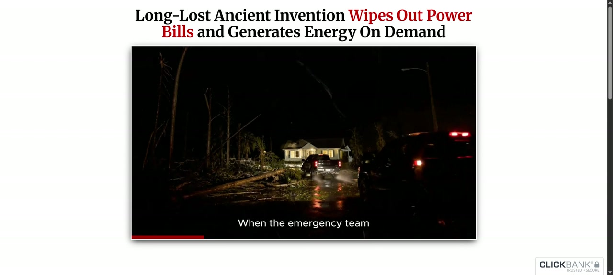
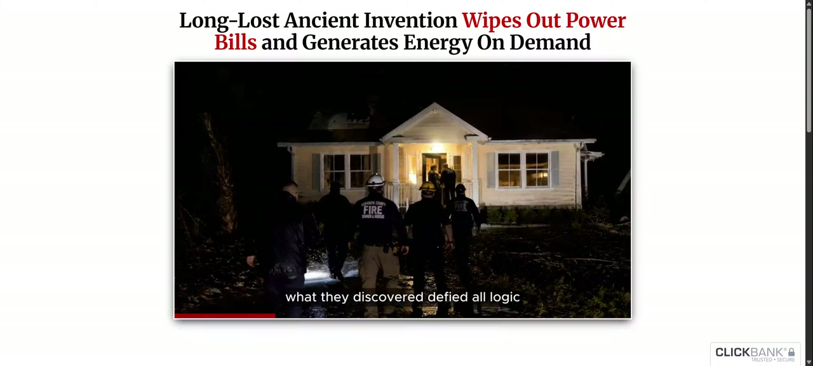
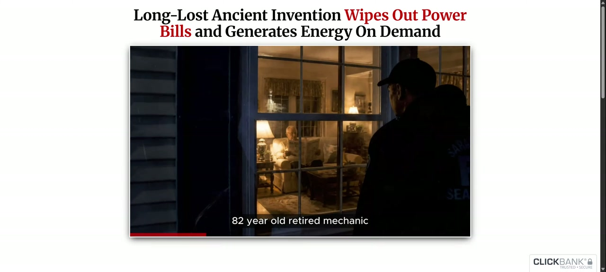

# VSL Study report

- Source: `C:\Users\Tomas\AppData\Local\VSL Study\captures\010fac1ba67146b7a8f7c8e615dd9ca2\recording.fixed.webm`
- Duration: 00:02:00.062 (120.062s container/audio)
- Dimensions: 3840x1730
- Audio: yes
- Model: small.en / language: en / device: cpu
- Detector: adaptive / interval: 5.0s

## Processing notes

- Video stream duration: 119.377s (screenshots use this bound, not audio length)
- Container FPS metadata is not treated as a measured frame rate.
- Device: CUDA not available or not supported; using CPU (fp32). This is not real-time.
- Input: browser tab recording. Timestamps are relative to this recording, not the original video.
- Recording id: `010fac1ba67146b7a8f7c8e615dd9ca2`
- Stop reason: max_duration · complete: True
- Address the user typed (not proof of the selected tab): `https://theenergyrevolution.net/index-ers-auto-lead-39-promise-epp-lead-6-v3-u7-u10.php`
- Title: My first test ever
- Recorded media duration: 120.062s
- Timestamps are relative to this recording, not verified times in the original video. Pauses, buffering, lead-in, and seeking can make the two timelines differ. The URL is what the user typed; it is not proof that the selected tab matched.
- Capture note: Container duration was missing; a copy remux restored seek metadata.
- Timestamp labels are in captions, not burned into screenshot pixels.

## Gaps

- `{'type': 'media_note', 'detail': 'Container reports 1000 FPS from timestamp units; this is not a measured capture frame rate.'}`
- `{'type': 'media_note', 'detail': 'Video stream duration is 119.377s; container/audio duration is 120.062s. Screenshots stop at the last available video frame. Speech after that still uses the full soundtrack.'}`
- `{'type': 'media_note', 'detail': 'Variable frame rate detected. Screenshot times use presentation timestamps from ffmpeg, not frame_index/average_fps. Scene boundary seconds from PySceneDetect still use the decoder time base and may differ slightly on VFR.'}`
- `{'type': 'media_note', 'detail': 'Audio start_time=0.062s vs video start_time=0.000s. Extracted WAV is silence-padded so Whisper times stay on the video timeline.'}`

## Scenes

- scene_0001: 00:00:00.000 – 00:00:00.303
- scene_0002: 00:00:00.303 – 00:00:01.075
- scene_0003: 00:00:01.075 – 00:00:01.308
- scene_0004: 00:00:01.308 – 00:00:01.508
- scene_0005: 00:00:01.508 – 00:00:02.459
- scene_0006: 00:00:02.459 – 00:00:03.459
- scene_0007: 00:00:03.459 – 00:00:03.858
- scene_0008: 00:00:03.858 – 00:00:04.791
- scene_0009: 00:00:04.791 – 00:00:05.791
- scene_0010: 00:00:05.791 – 00:00:10.425
- scene_0011: 00:00:10.425 – 00:00:11.891
- scene_0012: 00:00:11.891 – 00:00:13.791
- scene_0013: 00:00:13.791 – 00:00:15.875
- scene_0014: 00:00:15.875 – 00:00:22.341
- scene_0015: 00:00:22.341 – 00:00:28.875
- scene_0016: 00:00:28.875 – 00:00:32.666
- scene_0017: 00:00:32.666 – 00:00:33.658
- scene_0018: 00:00:33.658 – 00:00:38.898
- scene_0019: 00:00:38.898 – 00:00:42.875
- scene_0020: 00:00:42.875 – 00:00:51.691
- scene_0021: 00:00:51.691 – 00:00:51.924
- scene_0022: 00:00:51.924 – 00:00:54.524
- scene_0023: 00:00:54.524 – 00:00:57.708
- scene_0024: 00:00:57.708 – 00:00:58.441
- scene_0025: 00:00:58.441 – 00:00:59.541
- scene_0026: 00:00:59.541 – 00:01:04.241
- scene_0027: 00:01:04.241 – 00:01:11.924
- scene_0028: 00:01:11.924 – 00:01:13.191
- scene_0029: 00:01:13.191 – 00:01:16.691
- scene_0030: 00:01:16.691 – 00:01:17.158
- scene_0031: 00:01:17.158 – 00:01:18.158
- scene_0032: 00:01:18.158 – 00:01:19.591
- scene_0033: 00:01:19.591 – 00:01:20.763
- scene_0034: 00:01:20.763 – 00:01:22.291
- scene_0035: 00:01:22.291 – 00:01:23.824
- scene_0036: 00:01:23.824 – 00:01:25.024
- scene_0037: 00:01:25.024 – 00:01:26.841
- scene_0038: 00:01:26.841 – 00:01:29.257
- scene_0039: 00:01:29.257 – 00:01:31.508
- scene_0040: 00:01:31.508 – 00:01:33.641
- scene_0041: 00:01:33.641 – 00:01:34.408
- scene_0042: 00:01:34.408 – 00:01:35.543
- scene_0043: 00:01:35.543 – 00:01:35.748
- scene_0044: 00:01:35.748 – 00:01:36.175
- scene_0045: 00:01:36.175 – 00:01:36.475
- scene_0046: 00:01:36.475 – 00:01:42.241
- scene_0047: 00:01:42.241 – 00:01:44.208
- scene_0048: 00:01:44.208 – 00:01:47.174
- scene_0049: 00:01:47.174 – 00:01:47.674
- scene_0050: 00:01:47.674 – 00:01:50.524
- scene_0051: 00:01:50.524 – 00:01:50.857
- scene_0052: 00:01:50.857 – 00:01:52.624
- scene_0053: 00:01:52.624 – 00:01:57.291
- scene_0054: 00:01:57.291 – 00:01:57.874
- scene_0055: 00:01:57.874 – 00:02:00.062

## Transcript

- `seg_0001` 00:00:00.000–00:00:09.080: A few years ago, when Hurricane Marcus devastated the Gulf Coast, leaving 1.8 million families
- `seg_0002` 00:00:09.080–00:00:14.300: without power for weeks, emergency crews were using drones to survey the destruction, searching
- `seg_0003` 00:00:14.300–00:00:17.920: for signs of life in neighborhoods that looked like war zones.
- `seg_0004` 00:00:17.920–00:00:22.000: That's when rescue coordinator Sarah Chen noticed something impossible.
- `seg_0005` 00:00:22.000–00:00:27.320: One small house was glowing with warm light, while everything else for miles around sat
- `seg_0006` 00:00:27.320–00:00:29.200: in complete darkness.
- `seg_0007` 00:00:29.200–00:00:33.720: When the emergency team finally reached that address, what they discovered defied all logic.
- `seg_0008` 00:00:33.720–00:00:39.200: 82-year-old retired mechanic Tom Rodriguez was peacefully reading his evening paper.
- `seg_0009` 00:00:39.200–00:00:43.200: Lights on throughout the house, television broadcasting the weather report, even his
- `seg_0010` 00:00:43.200–00:00:46.200: old chest freezer keeping his ice cream frozen solid.
- `seg_0011` 00:00:46.200–00:00:50.480: Meanwhile, his neighbors were huddled around candles, wondering if they'd have power again
- `seg_0012` 00:00:50.480–00:00:51.480: before Christmas.
- `seg_0013` 00:00:51.480–00:00:54.500: But here's the part that makes absolutely no sense.
- `seg_0014` 00:00:54.500–00:00:59.020: There was no backup generator humming in his yard, no expensive solar array on his
- `seg_0015` 00:00:59.020–00:01:03.980: roof, and the main power cables to his street had been completely severed by a massive pine
- `seg_0016` 00:01:03.980–00:01:04.980: tree.
- `seg_0017` 00:01:04.980–00:01:09.020: When Sarah asked Tom how his lights were still working, the old man just smiled and said
- `seg_0018` 00:01:09.020–00:01:12.020: he'd figured out a little trick years ago.
- `seg_0019` 00:01:12.020–00:01:16.300: That little trick was about to reveal the most closely guarded secret in the energy
- `seg_0020` 00:01:16.300–00:01:17.300: industry.
- `seg_0021` 00:01:17.300–00:01:21.780: Four days later, when utility repair crews finally arrived to restore power to the neighborhood,
- `seg_0022` 00:01:21.780–00:01:24.460: their diagnostic equipment started acting erratic.
- `seg_0023` 00:01:24.460–00:01:26.900: The power meters were running in reverse.
- `seg_0024` 00:01:26.900–00:01:30.500: Tom wasn't just consuming electricity, he was producing it.
- `seg_0025` 00:01:30.500–00:01:35.900: So much surplus energy that his home was actually heating power back into the damaged grid.
- `seg_0026` 00:01:35.900–00:01:40.300: The lead technician stared at his readings in complete shock, informing Tom that the
- `seg_0027` 00:01:40.300–00:01:46.060: utility company now owed him $387 for the excess electricity he'd generated during
- `seg_0028` 00:01:46.060–00:01:47.100: the blackout.
- `seg_0029` 00:01:47.100–00:01:50.860: But that $387 payment was just the beginning.
- `seg_0030` 00:01:50.860–00:01:57.180: Over the following eight months, the power company sent Tom checks totaling $2,156.
- `seg_0031` 00:01:57.180–00:01:59.500: And Tom isn't some brilliant engineer with it.

## On-screen text (OCR)

This layer is separate from spoken transcript. OCR is not calibrated accuracy.

OCR was turned off for this job. Re-run with OCR enabled to capture slides, prices, and captions.

## Screenshots

A still does not illustrate an entire long spoken passage. Nearby segment IDs are time matches only.

- `frame_0001` 00:00:00.000 (interval, scene_0001)
  - requested 00:00:00.000; nearby ['seg_0001']
  - 
- `frame_0002` 00:00:00.183 (scene_start, scene_0001) (compact view refers to `frame_0001`)
  - requested 00:00:00.152; nearby ['seg_0001']
  - 
- `frame_0003` 00:00:00.583 (scene_start, scene_0002) (compact view refers to `frame_0001`)
  - requested 00:00:00.553; nearby ['seg_0001']
  - 
- `frame_0004` 00:00:01.308 (scene_start, scene_0003) (compact view refers to `frame_0001`)
  - requested 00:00:01.192; nearby ['seg_0001']
  - 
- `frame_0005` 00:00:01.408 (scene_start, scene_0004) (compact view refers to `frame_0001`)
  - requested 00:00:01.408; nearby ['seg_0001']
  - 
- `frame_0006` 00:00:01.795 (scene_start, scene_0005) (compact view refers to `frame_0001`)
  - requested 00:00:01.758; nearby ['seg_0001']
  - 
- `frame_0007` 00:00:02.792 (scene_start, scene_0006) (compact view refers to `frame_0001`)
  - requested 00:00:02.709; nearby ['seg_0001']
  - 
- `frame_0008` 00:00:03.692 (scene_start, scene_0007)
  - requested 00:00:03.658; nearby ['seg_0001']
  - 
- `frame_0009` 00:00:04.159 (scene_start, scene_0008)
  - requested 00:00:04.108; nearby ['seg_0001']
  - 
- `frame_0010` 00:00:05.058 (interval, scene_0009) (compact view refers to `frame_0009`)
  - requested 00:00:05.000; nearby ['seg_0001']
  - 
- `frame_0011` 00:00:05.058 (scene_start, scene_0009) (compact view refers to `frame_0009`)
  - requested 00:00:05.041; nearby ['seg_0001']
  - 
- `frame_0012` 00:00:06.091 (scene_start, scene_0010) (compact view refers to `frame_0009`)
  - requested 00:00:06.041; nearby ['seg_0001']
  - 
- `frame_0013` 00:00:10.058 (interval, scene_0010) (compact view refers to `frame_0009`)
  - requested 00:00:10.000; nearby ['seg_0001', 'seg_0002']
  - 
- `frame_0014` 00:00:10.691 (scene_start, scene_0011) (compact view refers to `frame_0009`)
  - requested 00:00:10.675; nearby ['seg_0001', 'seg_0002']
  - 
- `frame_0015` 00:00:12.164 (scene_start, scene_0012) (compact view refers to `frame_0009`)
  - requested 00:00:12.141; nearby ['seg_0002']
  - 
- `frame_0016` 00:00:14.051 (scene_start, scene_0013) (compact view refers to `frame_0009`)
  - requested 00:00:14.041; nearby ['seg_0002', 'seg_0003']
  - 
- `frame_0017` 00:00:15.008 (interval, scene_0013) (compact view refers to `frame_0009`)
  - requested 00:00:15.000; nearby ['seg_0002', 'seg_0003']
  - 
- `frame_0018` 00:00:16.141 (scene_start, scene_0014) (compact view refers to `frame_0009`)
  - requested 00:00:16.125; nearby ['seg_0002', 'seg_0003', 'seg_0004']
  - 
- `frame_0019` 00:00:20.041 (interval, scene_0014) (compact view refers to `frame_0009`)
  - requested 00:00:20.000; nearby ['seg_0004', 'seg_0005']
  - 
- `frame_0020` 00:00:22.608 (scene_start, scene_0015) (compact view refers to `frame_0009`)
  - requested 00:00:22.591; nearby ['seg_0004', 'seg_0005']
  - 
- `frame_0021` 00:00:25.008 (interval, scene_0015) (compact view refers to `frame_0009`)
  - requested 00:00:25.000; nearby ['seg_0005']
  - 
- `frame_0022` 00:00:29.143 (scene_start, scene_0016) (compact view refers to `frame_0009`)
  - requested 00:00:29.125; nearby ['seg_0005', 'seg_0006', 'seg_0007']
  - 
- `frame_0023` 00:00:30.009 (interval, scene_0016) (compact view refers to `frame_0009`)
  - requested 00:00:30.000; nearby ['seg_0006', 'seg_0007']
  - 
- `frame_0024` 00:00:32.925 (scene_start, scene_0017) (compact view refers to `frame_0009`)
  - requested 00:00:32.916; nearby ['seg_0007', 'seg_0008']
  - 
- `frame_0025` 00:00:33.959 (scene_start, scene_0018) (compact view refers to `frame_0009`)
  - requested 00:00:33.908; nearby ['seg_0007', 'seg_0008']
  - 
- `frame_0026` 00:00:35.058 (interval, scene_0018) (compact view refers to `frame_0009`)
  - requested 00:00:35.000; nearby ['seg_0007', 'seg_0008']
  - 
- `frame_0027` 00:00:39.158 (scene_start, scene_0019) (compact view refers to `frame_0009`)
  - requested 00:00:39.148; nearby ['seg_0008', 'seg_0009']
  - 
- `frame_0028` 00:00:40.025 (interval, scene_0019) (compact view refers to `frame_0009`)
  - requested 00:00:40.000; nearby ['seg_0008', 'seg_0009']
  - 
- `frame_0029` 00:00:43.125 (scene_start, scene_0020) (compact view refers to `frame_0009`)
  - requested 00:00:43.125; nearby ['seg_0009', 'seg_0010']
  - 
- `frame_0030` 00:00:45.034 (interval, scene_0020) (compact view refers to `frame_0009`)
  - requested 00:00:45.000; nearby ['seg_0009', 'seg_0010', 'seg_0011']
  - 
- `frame_0031` 00:00:50.024 (interval, scene_0020) (compact view refers to `frame_0009`)
  - requested 00:00:50.000; nearby ['seg_0011', 'seg_0012', 'seg_0013']
  - 
- `frame_0032` 00:00:51.857 (scene_start, scene_0021)
  - requested 00:00:51.808; nearby ['seg_0011', 'seg_0012', 'seg_0013']
  - 
- `frame_0033` 00:00:52.191 (scene_start, scene_0022)
  - requested 00:00:52.174; nearby ['seg_0011', 'seg_0012', 'seg_0013']
  - 
- `frame_0034` 00:00:54.841 (scene_start, scene_0023) (compact view refers to `frame_0033`)
  - requested 00:00:54.774; nearby ['seg_0013', 'seg_0014']
  - 
- `frame_0035` 00:00:55.025 (interval, scene_0023) (compact view refers to `frame_0033`)
  - requested 00:00:55.000; nearby ['seg_0013', 'seg_0014']
  - 
- `frame_0036` 00:00:57.974 (scene_start, scene_0024) (compact view refers to `frame_0033`)
  - requested 00:00:57.958; nearby ['seg_0014', 'seg_0015']
  - 
- `frame_0037` 00:00:58.711 (scene_start, scene_0025) (compact view refers to `frame_0033`)
  - requested 00:00:58.691; nearby ['seg_0014', 'seg_0015']
  - 
- `frame_0038` 00:00:59.841 (scene_start, scene_0026) (compact view refers to `frame_0033`)
  - requested 00:00:59.791; nearby ['seg_0014', 'seg_0015']
  - 
- `frame_0039` 00:01:00.012 (interval, scene_0026) (compact view refers to `frame_0033`)
  - requested 00:01:00.000; nearby ['seg_0014', 'seg_0015']
  - 
- `frame_0040` 00:01:04.508 (scene_start, scene_0027)
  - requested 00:01:04.491; nearby ['seg_0015', 'seg_0016', 'seg_0017']
  - 
- `frame_0041` 00:01:05.041 (interval, scene_0027)
  - requested 00:01:05.000; nearby ['seg_0015', 'seg_0016', 'seg_0017']
  - 
- `frame_0042` 00:01:10.041 (interval, scene_0027) (compact view refers to `frame_0041`)
  - requested 00:01:10.000; nearby ['seg_0017', 'seg_0018', 'seg_0019']
  - 
- `frame_0043` 00:01:12.191 (scene_start, scene_0028) (compact view refers to `frame_0041`)
  - requested 00:01:12.174; nearby ['seg_0018', 'seg_0019']
  - 
- `frame_0044` 00:01:13.491 (scene_start, scene_0029) (compact view refers to `frame_0041`)
  - requested 00:01:13.441; nearby ['seg_0018', 'seg_0019']
  - 
- `frame_0045` 00:01:15.024 (interval, scene_0029) (compact view refers to `frame_0041`)
  - requested 00:01:15.000; nearby ['seg_0019', 'seg_0020']
  - 
- `frame_0046` 00:01:16.960 (scene_start, scene_0030)
  - requested 00:01:16.924; nearby ['seg_0019', 'seg_0020', 'seg_0021']
  - 
- `frame_0047` 00:01:17.491 (scene_start, scene_0031)
  - requested 00:01:17.408; nearby ['seg_0019', 'seg_0020', 'seg_0021']
  - 
- `frame_0048` 00:01:18.458 (scene_start, scene_0032) (compact view refers to `frame_0047`)
  - requested 00:01:18.408; nearby ['seg_0020', 'seg_0021']
  - 
- `frame_0049` 00:01:19.891 (scene_start, scene_0033)
  - requested 00:01:19.841; nearby ['seg_0021', 'seg_0022']
  - 
- `frame_0050` 00:01:20.058 (interval, scene_0033)
  - requested 00:01:20.000; nearby ['seg_0021', 'seg_0022']
  - 
- `frame_0051` 00:01:21.025 (scene_start, scene_0034) (compact view refers to `frame_0050`)
  - requested 00:01:21.013; nearby ['seg_0021', 'seg_0022']
  - 
- `frame_0052` 00:01:22.591 (scene_start, scene_0035) (compact view refers to `frame_0050`)
  - requested 00:01:22.541; nearby ['seg_0021', 'seg_0022', 'seg_0023']
  - 
- `frame_0053` 00:01:24.124 (scene_start, scene_0036) (compact view refers to `frame_0050`)
  - requested 00:01:24.074; nearby ['seg_0022', 'seg_0023']
  - 
- `frame_0054` 00:01:25.024 (interval, scene_0036)
  - requested 00:01:25.000; nearby ['seg_0022', 'seg_0023', 'seg_0024']
  - 
- `frame_0055` 00:01:25.291 (scene_start, scene_0037) (compact view refers to `frame_0054`)
  - requested 00:01:25.274; nearby ['seg_0022', 'seg_0023', 'seg_0024']
  - 
- `frame_0056` 00:01:27.108 (scene_start, scene_0038) (compact view refers to `frame_0054`)
  - requested 00:01:27.091; nearby ['seg_0023', 'seg_0024']
  - 
- `frame_0057` 00:01:29.553 (scene_start, scene_0039) (compact view refers to `frame_0054`)
  - requested 00:01:29.507; nearby ['seg_0024', 'seg_0025']
  - 
- `frame_0058` 00:01:30.108 (interval, scene_0039) (compact view refers to `frame_0054`)
  - requested 00:01:30.000; nearby ['seg_0024', 'seg_0025']
  - 
- `frame_0059` 00:01:31.807 (scene_start, scene_0040) (compact view refers to `frame_0054`)
  - requested 00:01:31.758; nearby ['seg_0024', 'seg_0025']
  - 
- `frame_0060` 00:01:33.941 (scene_start, scene_0041) (compact view refers to `frame_0054`)
  - requested 00:01:33.891; nearby ['seg_0025', 'seg_0026']
  - 
- `frame_0061` 00:01:34.674 (scene_start, scene_0042) (compact view refers to `frame_0054`)
  - requested 00:01:34.658; nearby ['seg_0025', 'seg_0026']
  - 
- `frame_0062` 00:01:35.041 (interval, scene_0042) (compact view refers to `frame_0054`)
  - requested 00:01:35.000; nearby ['seg_0025', 'seg_0026']
  - 
- `frame_0063` 00:01:35.980 (scene_start, scene_0043)
  - requested 00:01:35.646; nearby ['seg_0025', 'seg_0026']
  - 
- `frame_0064` 00:01:35.980 (scene_start, scene_0044) (compact view refers to `frame_0063`)
  - requested 00:01:35.962; nearby ['seg_0025', 'seg_0026']
  - 
- `frame_0065` 00:01:36.346 (scene_start, scene_0045)
  - requested 00:01:36.325; nearby ['seg_0025', 'seg_0026']
  - 
- `frame_0066` 00:01:36.746 (scene_start, scene_0046) (compact view refers to `frame_0065`)
  - requested 00:01:36.725; nearby ['seg_0025', 'seg_0026']
  - 
- `frame_0067` 00:01:40.009 (interval, scene_0046) (compact view refers to `frame_0065`)
  - requested 00:01:40.000; nearby ['seg_0026', 'seg_0027']
  - 
- `frame_0068` 00:01:42.507 (scene_start, scene_0047) (compact view refers to `frame_0065`)
  - requested 00:01:42.491; nearby ['seg_0027']
  - 
- `frame_0069` 00:01:44.507 (scene_start, scene_0048) (compact view refers to `frame_0065`)
  - requested 00:01:44.458; nearby ['seg_0027', 'seg_0028']
  - 
- `frame_0070` 00:01:45.041 (interval, scene_0048) (compact view refers to `frame_0065`)
  - requested 00:01:45.000; nearby ['seg_0027', 'seg_0028']
  - 
- `frame_0071` 00:01:47.474 (scene_start, scene_0049) (compact view refers to `frame_0065`)
  - requested 00:01:47.424; nearby ['seg_0027', 'seg_0028', 'seg_0029']
  - 
- `frame_0072` 00:01:47.974 (scene_start, scene_0050) (compact view refers to `frame_0065`)
  - requested 00:01:47.924; nearby ['seg_0027', 'seg_0028', 'seg_0029']
  - 
- `frame_0073` 00:01:50.026 (interval, scene_0050) (compact view refers to `frame_0065`)
  - requested 00:01:50.000; nearby ['seg_0029', 'seg_0030']
  - 
- `frame_0074` 00:01:50.724 (scene_start, scene_0051)
  - requested 00:01:50.690; nearby ['seg_0029', 'seg_0030']
  - 
- `frame_0075` 00:01:51.191 (scene_start, scene_0052)
  - requested 00:01:51.107; nearby ['seg_0029', 'seg_0030']
  - 
- `frame_0076` 00:01:52.924 (scene_start, scene_0053) (compact view refers to `frame_0075`)
  - requested 00:01:52.874; nearby ['seg_0030']
  - 
- `frame_0077` 00:01:55.024 (interval, scene_0053) (compact view refers to `frame_0075`)
  - requested 00:01:55.000; nearby ['seg_0030']
  - 
- `frame_0078` 00:01:57.593 (scene_start, scene_0054) (compact view refers to `frame_0075`)
  - requested 00:01:57.541; nearby ['seg_0030', 'seg_0031']
  - 
- `frame_0079` 00:01:58.141 (scene_start, scene_0055) (compact view refers to `frame_0075`)
  - requested 00:01:58.124; nearby ['seg_0030', 'seg_0031']
  - 
- `frame_0080` 00:01:59.376 (interval, scene_0055) (compact view refers to `frame_0075`)
  - requested 00:01:59.377; nearby ['seg_0031']
  - 

## Versions

- openai-whisper: 20250625
- scenedetect: 0.7.1
- torch: 2.14.0+cpu
- cuda: no
- streamlit: 1.63.0
- pillow: 11.3.0
- rapidocr: RapidOCR onnxruntime (default on-screen engine)
- tesseract: tesseract v5.4.0.20240606 (C:\Program Files\Tesseract-OCR\tesseract.EXE)

## Stage status

```json
{
  "inspect": {
    "status": "complete",
    "cache_key": "b01e5aa26fac2c3442df1dad7358a00fbd527104126d05294ee12a15561bfc2c|media-v2"
  },
  "transcribe": {
    "status": "complete",
    "cache_key": "b01e5aa26fac2c3442df1dad7358a00fbd527104126d05294ee12a15561bfc2c|small.en|en|transcribe"
  },
  "audio": {
    "status": "complete",
    "cache_key": "b01e5aa26fac2c3442df1dad7358a00fbd527104126d05294ee12a15561bfc2c"
  },
  "scenes": {
    "status": "complete",
    "cache_key": "b01e5aa26fac2c3442df1dad7358a00fbd527104126d05294ee12a15561bfc2c|adaptive|seconds-1"
  },
  "frames": {
    "status": "complete",
    "cache_key": "b01e5aa26fac2c3442df1dad7358a00fbd527104126d05294ee12a15561bfc2c|adaptive|5.000|0.250|1280||seq-pts-4"
  },
  "ocr": {
    "status": "complete",
    "cache_key": "v2|ocr=False|186f9da89d0a5f59d1e1f7ff17cb4d88938e46d5"
  }
}
```
